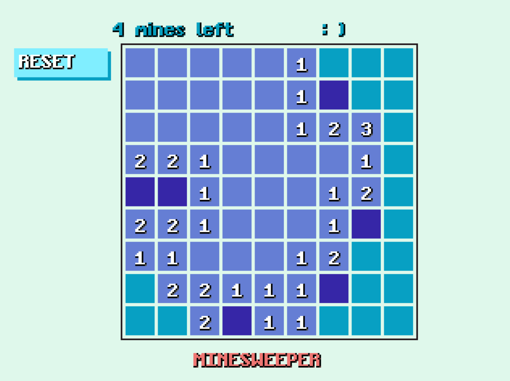

# Some games
Some games that I personally enjoy and recreated.

These games require the [TIGR library](https://github.com/erkkah/tigr), eg `gcc .\sudokuGUI.c .\tigr.c -lopengl32 -lgdi32 -o sudokuGUI`.

## Sudoku
You use the mouse to choose a difficulty, and then use the keyboard to navigate the cursor on the board, pressing the digit keys will edit the number in that cell, assuming it can be edited.
You use the mouse to use the `exit` and `reset` buttons on the left.

## Minesweeper
Minesweeper is played purely with the mouse.

